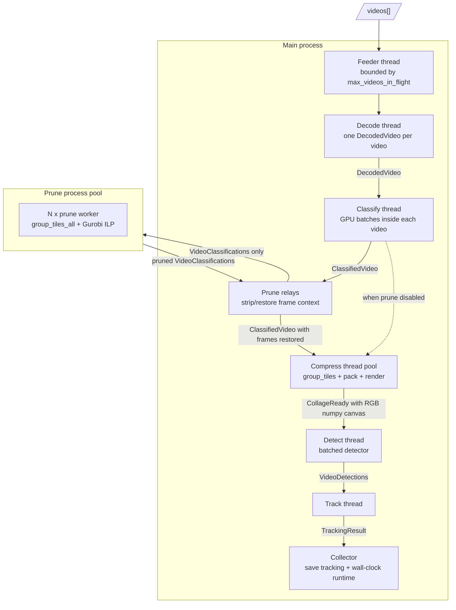

# Pipeline-Parallel Execution Runner - Design

This document describes the throughput-focused runner under `execution/`.
The runner keeps the scripts path intact, but replaces the sequential
p020 -> p022 -> p030 -> p040 -> p050 -> p060 flow with an in-memory path.

The current design optimizes for research throughput and simpler architecture,
not production-grade recovery.  Stage failures may terminate a worker/thread
without a custom error monitor.

## 1. Goals

- Run one parameter combination end-to-end.
- Keep pipeline parallelism across videos.
- Treat one video as the unit passed between stages.
- Keep ILP pruning in multiple processes.
- Keep compress in-process with a thread pool after releasing the GIL around
  native `group_tiles` and `pack` calls.
- Avoid intermediate disk I/O.
- Avoid frame/canvas shared-memory handoff in the hot path.
- Save the same final `tracking.jsonl` schema as `scripts/p060`.

Non-goals:

- Parameter sweeps in one invocation.
- Production-style fault recovery.
- Multi-GPU sharding inside one stage.

## 2. Architecture



Process count: one main process plus `--prune-workers` when pruning is enabled.

Main-process threads:

- Feeder
- Decode
- Classify
- Detect
- Track
- Prune fan-out/fan-in relays when pruning is enabled
- Compress worker threads plus fan-out/fan-in relays

Removed from the previous design:

- `ErrorMonitor`
- `TimingCollector`
- `StageTiming`
- `PipelineError`
- frame shared memory
- canvas handoff shared memory
- `VideoCompressDone`
- semaphore release helper thread

## 3. Data Flow

### Decode

Decode emits one `DecodedVideo` message per input video.  The message carries:

- RGB frames needed by downstream stages
- source resolution and frame count
- sampled frame indices
- retained buffer frame indices
- sampled-frame and previous-frame buffer positions for classify

Backend choice:

- `sample_rate == 1`: OpenCV full decode.
- `sample_rate > 1`: FFmpeg `select` sparse decode for sampled frames, previous
  frames, and the final frame.

### Classify

Classify consumes `DecodedVideo` and emits `ClassifiedVideo`.  Classification
grids are typed `uint8` numpy arrays, not hex strings.  `--classify-batch-size`
controls the internal GPU batch size.

### Prune

Prune remains multi-process because ILP/Gurobi scaling is process-based.  The
main process stores the full `ClassifiedVideo` frame context, sends only
`VideoClassifications` to prune workers, then restores the frame context after
the pruned classifications return.

Gurobi thread count is intentionally not set by the runner.

### Compress

Compress is a main-process thread pool.  It receives `ClassifiedVideo`, runs
`group_tiles`, `pack`, and `render_collage_cpu`, then emits `CollageReady`
messages with RGB numpy canvases.

Native polyomino arrays returned by `group_tiles` are not explicitly freed.
This is an accepted research-run risk in the current design.

### Detect

Detect batches RGB canvases up to `--detect-batch-size` and calls
`detect_batch(..., mode=DetectorMode.RGB)`.  The detector abstraction owns
backend-specific color conversion.

Detect still flushes early when a batch would complete a video so tracking can
start without waiting for unrelated collages.

### Track

Track is sequential per video and emits the final `TrackingResult`.

## 4. Backpressure

`--max-videos-in-flight` bounds the number of videos admitted to the pipeline.
The feeder acquires a permit before queueing a video.  The collector releases a
permit when that video's final `TrackingResult` is saved.

This is more conservative than the earlier frame-buffer-only bound, but it
removes the `VideoCompressDone` side channel and semaphore releaser thread.

## 5. Output

Tracking output remains:

```text
cache.exec(dataset, 'ucomp-tracks', video, param_str, 'tracking.jsonl')
```

The runtime summary remains append-only but now contains only wall-clock
pipeline timing and per-video completion timestamps:

```json
{
  "config": "...",
  "param_str": "...",
  "elapsed_ms": 0,
  "num_videos": 0,
  "per_video_complete_ts": {}
}
```

Use `python -m execution.benchmark -- ...` for repeatable external throughput
measurements.  The benchmark wrapper records elapsed seconds, videos/sec, and
frames/sec without adding hot-path instrumentation.

## 6. CLI Surface

Required algorithmic flags are unchanged.

Resource flags:

```text
--classify-gpu 0
--detect-gpu 0
--prune-workers max(1, cpu_count // 4)
--compress-workers max(2, cpu_count // 2)
--max-videos-in-flight 2
--classify-batch-size 16
--detect-batch-size 4
```

Behavior flags:

```text
--no-interpolate
--no-warmup
--max-videos N
```

The warmup path is intentionally unchanged from the previous runner.  The
known warmup hang remains a separate issue.

## 7. Testing Strategy

Run tests on `ace` inside the Docker container after `./sync`.

Important tests:

- `execution/tests/test_decode_stage.py`: exact sampled-frame decode behavior.
- `execution/tests/test_compress_stage.py`: threaded compress smoke/stress.
- `execution/tests/test_pool.py`: process/thread fan-out and fan-in relays.
- `execution/tests/test_render.py`: CPU canvas render helper.
- `execution/tests/test_prune_stage.py`: prune worker smoke.
- `execution/tests/test_track_stage.py`: tracker stage smoke.
- `execution/tests/test_integration_smoke.py`: full pipeline smoke.
- `execution/tests/test_validation.py`: tolerance-based validation vs scripts.

The old shared-memory and error-monitor tests were removed because those
components no longer exist.
